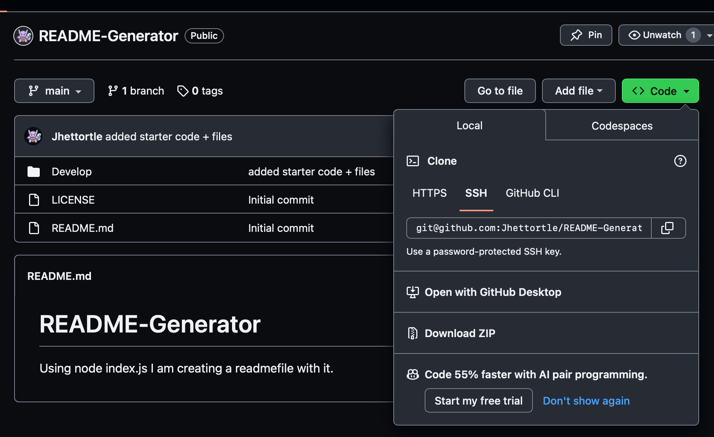
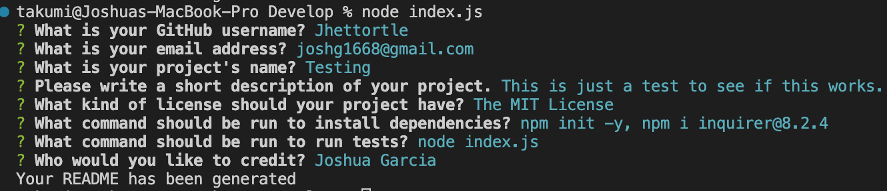

# README-Generator

## Table of Contents
* [Installation](#installation)
* [Description](#description)
* [License](#license)
* [Credit](#credit)

## Installation 
You can clone this repo!

## Description
This is just a basic README generator app using Node.js. Once you have cloned this repo and npm has been installed, type node index.js and the questions should pop up for you to start creating your **README**. 

## License   

[ MIT License ](./LICENSE)

## Credit
Joshua Garcia 
